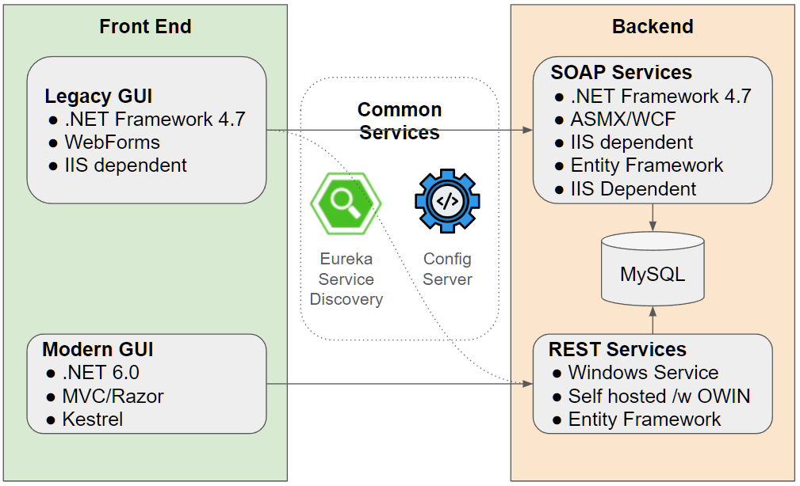

# PCF .NET Demo
This solution demonstrates the use of multiple microservices built using multiple .NET technologies and running on PCF. The primary goal is to show that PCF can handle legacy code that existed as early as .NET version 1.0, with common stacks introduced as part of .NET framework up to the newest .NET core application. The solution demonstrates a natural progression / evolution that a customer would take towards making their apps cloud native.

Technical Features Demonstrated:
- Running WebForms application
- Use of ASMX services
- WCF service connectivity
- OWIN bootstrap into IIS
- .NET core MVC application on Linux stack
- Service discovery via Eureka (using ASMX, WCF, and REST)
- MySQL connectivity using EntityFramework
- Config server with GIT repo

# Solution Projects

The solution revolves around a simple application that displays random quotes when a button is pressed. It also features a Kill command to simulate application failure.
* FunnyQuotesUIForms - Web forms GUI. Depends on Eureka and Config Server. Depending on config value served by Config Server, the source of the messages shown will be switched between local in memory, ASMX service, WCF service, or REST
* FunnyQuotesLegacyService - Contains ASMX service and WCF service implementations for serving messages
   * ASMX fetches it's data from database connectivity via classic DataSet / DataAdapter approach
   * WCF featches data from database using a more modern approach using entity Framework
* FunnyQuotesServicesOwin - Rest based implementation using OWIN with WebAPI. Intended to be run on Windows stack with HWC
* FunnyQuotesUICore - Modern .NET core version running on linux stack. Calls backend services directly from javascript.

# How to build
* Open Visual Studio. 
* Publish each product using supplied publish profile.
* Output is places in `\publish\` folder
* Use `create-services.bat` and `manifest.yml` in `\scripts` to push everything to PCF (copy manifest into publish folder) 

### Prerequisites
* Visual Studio with .NET core support
* Docker with images for
  * Config server
  * Eureka
  * Hystrix dashboard
  * MySQL

**Config Repo:** https://github.com/Pivotal-Field-Engineering/funny-quotes-config

# How to present
See `docs` folder
